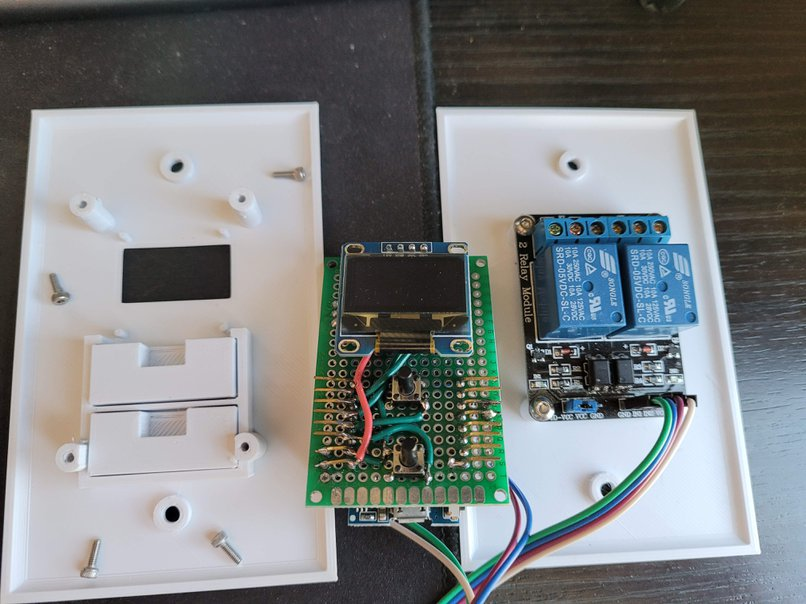
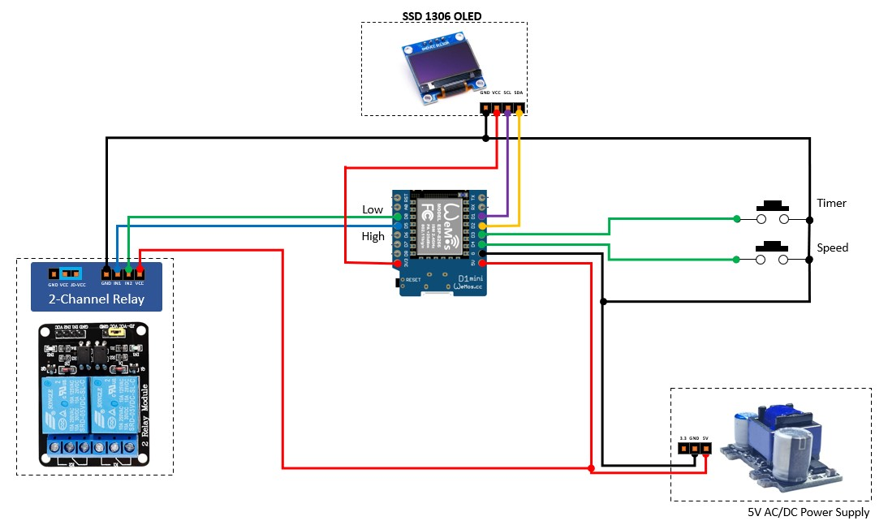
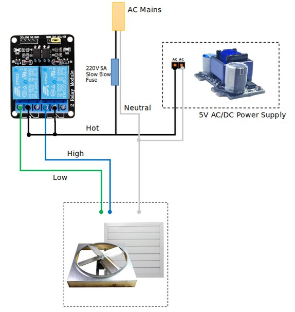

# Smart Whole House Fan

## ESP8266 Based Whole House Fan Controller / Timer

This is a _smarter_ whole house fan controller that can be controlled via a Web UI, and sports a nice OLED screen for status while operating.

__Features:__

* Web UI for controlling speed and setting timer
* OLED Screen displays operation and timer
* Physical buttons to adjust speed and timer
* Physical button LOCK to prevent kids, accidental or curious button pushers from starting up the fan when you don't want them to
* REST API for controlling the fan via an application (no API key)
* MQTT support for Home Assistant (this needs some help, but the basics work)
* 3D Printable Faceplates / Buttons for mounting

__Pictures:__


The final product.  


Chrome Screenshot on a mobile device.


Home Assistant Screenshot on a mobile device.


This is the final 3D Printed design with integrated buttons on the control side and a thicker wall plate on the relay side (for more space).


This is the original 3D printed design, with large free-floating buttons.  But this give you a better idea of what the display looks like. 


Example of what happens when the physical buttons are locked out and someone presses a button.  


An example of how I mounted the perfboard to the backside of the outlet faceplate.  Also the relay mounted to the back of the faceplate.  In retrospect, it might be good to mount the relay up higher so that it has space for the wiring coming out of the bottom.  


Front side of the perfboard wiring, with tack switches, and OLED display.  Note I used some taller tack switches, but you could modify the buttons ont he 3D print to go lower if you want.  


AHhh! Not enough space for the relay to tuck up into this outlet.  I ended up switching to smaller wire nuts and 18 AWG wire for the connections to the relay AND thickened the 3D printed wall plate so that it could all fit.  

### The Parts List

* **ESP8266 Board** - I used a Wemos D1 Mini due to it's small form factor, but many other variants of ESP8266 boards could be used as well.  I ordered [these D1 Mini boards](https://www.amazon.com/gp/product/B081PX9YFV) from Amazon, which are great because they come with lots of header options that you can choose from.  This made it easy for me to use a longer pin female headers to stick through the perfboard and to use to make connections to the other components.   
* **2-Channel Relay** - Used to control power to High / Low speeds. Using the mechanical relays, as they seem to have a higher current rating.  [Amazon Link](https://www.amazon.com/SainSmart-101-70-100-2-Channel-Relay-Module/dp/B0057OC6D8)
* **120V AC Power Supply to 5V DC** - Got this incredibly tiny supply from Amazon that can fit in the enclosure.  It's amazing.  [Amazon Link](https://www.amazon.com/gp/product/B08ZSW2PP8)
* **Dupont Cables** - Female to Female for connecting your GPIOs to the relay board. Readily found on Amazon, etc.  
* **SSD1306 OLED Display** - Cheap and commonly found OLED display. This is not the specific one I used, but here is a similar verson on [Amazon](https://www.amazon.com/128X64-Display-SSD1306-Arduino-Raspberry/dp/B085WCRS7C). 
* **Tactile Switches** - I purchased a bunch of sizes of tactile switches and just used the 8 or 9mm sizes for my project, but your mileage may vary. [Amazon Link](https://www.amazon.com/gp/product/B071KX71SV)
* **Project Board** - I utilized some standard 4cm x 6cm project board for this project, but you could choose to utilize other sizes.  [Amazon Link](https://www.amazon.com/gp/product/B00NQ37V0K)
* **2.54pitch headers** - As with the dupont cables, these can be readily found almost anywhere, including Amazon.   

### Default GPIO Mapping
+ GPIO 0 - Add Time Button
+ GPIO 2 - Cycle Speed Button (High, Low, Off)
+ GPIO 14 - Relay for HIGH speed
+ GPIO 16 - Relay for LOW speed 

### Schematics

Basic Wiring Schematic for the entire project.  This was built for my home system and yours may vary.  Please build this at your own risk.  The developer takes no responsibility for destroyed equipment, house fires, electric shock.  Please do not attempt unless you are confident you know what you are doing.  

__Low Voltage Schematic:__


__High Voltage Schematic:__


### HW Install

Standard whole house fan systems generally have two speeds that are selected by applying power to either the high speed circuit or the low speed circuit.  In the reference schematic above, we show that the relays are acting as the selector for the hot (black) wire, feeding AC current to the fan.  The nuetral should be wired together with a wirenut (or other terminal).  

I personally ended up using 18 guage wire for the connections to the relay due to the challenges of the tight space in my wall box.  However, you may want to check the wiring requirements for your whole house fan, to ensure you are using the minimum gauge wire.  

Also the power supply that I selected, simply needs mains hot and nuetral connected.  On this side, I used 18 gauge wire, simply because this is what I had, and it should be safe give the small amount of power this supply is using.  

## Software Installation

 ##### To install the ESP8266 board, (using Arduino 1.6.4+):
  - Add the following 3rd party board manager under "File -> Preferences -> Additional Boards Manager URLs":
       http://arduino.esp8266.com/stable/package_esp8266com_index.json
  - Open the "Tools -> Board -> Board Manager" and click install for the ESP8266"
  - Select your ESP8266 in "Tools -> Board"

 ##### Library Dependancies include:
   - WiFiManager (by TZAPU) (https://github.com/tzapu/WiFiManager)
   - Adafruit SSD1306 for the OLED display
   - Adafruit GFX library for graphics manipulations / fonts 
   - ArduinoJSON for parsing API inputs / outputs
   - PubSubClient for MQTT Capabilities

  To install the libraries, go to the libraries manager in the Arduino IDE (Tools -> Manage Libraries).  Search for the libraries listed above and install each.  

 ##### MQTT Settings

  Make sure that the following line in smart-whf.ino is not commented out:

  ```
  #define mqttenabled // Comment out this line to disable MQTT support
  ```
  
  In the smart-whf.ino file, modify your MQTT settings for your setup, if using the MQTT feature.  The WifiManager has all of these settings included, however, if you can pre-populate these, it makes setup just a little faster.  

```  
// Edit these values for your implementation
char defaultmqttServer[] = "192.168.10.46";  // put your MQTT Server Address here
char defaultmqttPort[] = "1883"; // put your MQTT Server Port here
char defaultmqttUser[] = "mqtt-user"; // put your MQTT Server Username here
char defaultmqttPassword[] = "password"; // put your MQTT Server Password here
// End value edit
```

 ##### Configure Home Assistant

   First you'll need to ensure that MQTT Broker has been installed from the add-on store.  This is out of scope of this guide, but it's likley that you already have this installed if you are reading this.  Then, modify the `configuration.yaml` file by adding the below:

```
# Configuration for the whole house fan in Home Assistant
# The below goes into your configuration.yaml file

fan whft:
- platform: mqtt
  name: "Whole House Fan"
  icon: "mdi:fan"
  state_topic: "whfan/on/state"
  command_topic: "whfan/on/set"
  percentage_state_topic: "whfan/percentage/state"
  percentage_command_topic: "whfan/percentage/set"
  preset_mode_command_topic: "whfan/preset/set"
  preset_mode_state_topic: "whfan/preset/state"
  preset_modes:
  - "timer"
  - "hold"
  - "off"
  payload_on: "ON"
  payload_off: "OFF"
  speed_range_min: 1
  speed_range_max: 2
  qos: 0  
```

Restart Home Assistant and you should be able to add the Smart Whole House Fan entity to your UI.  

__NOTE:__ I could _really_ use some help from anyone who has experience with Home Assistant to improve this configuration and MQTT support.  For example, being able to add time to the timer from the Home Assistant UI would be awesome.  This is an area I just haven't had time to mess with. 

 ##### Initial Wifi Setup: 
  - To connect your device to WiFi, use a smartphone or computer with WiFi to connect to the board AP (SSID: Smart-WHF-AP).
  - Then open a broswer and navigate to __192.168.4.1__ to configure the device for WiFi.
  - Optionally configure MQTT settings, if you have it built in.  
  - Once configured for your wifi network, you should be all set. 

 ### 3D Printed Parts

 You'll find STL's for 3D Printing your own faceplates in the `/assets/stl/` folder.  

 All STL files were created using OnShape which is free for personal use.  The original design files are located [here](https://cad.onshape.com/documents/4ed1076b86430447dbe85914/w/bb85ae4fb526a0970ad92e38/e/43ed86bf169133e95db9fccc) so that you can copy, export, and make your own tweaks to fit your needs.  

 There are a few options to choose from.  

- __Two single-gang outlet boxes:__ 
  * __Control-Face-Plate.stl:__ Standard Control Face Plate, without buttons.  In this configuration, you'll need to print the __SpeedButtonTall.stl__ and the __TimeButton-Tall.stl__ which can be assembled later.  I found this version to be a little finicky with button presses, but your mileage may vary.  All should print in place with no supports. 
  * __Control-Face-Plate-Int-Buttons.stl:__ This is the same Control Face Plate as above, but with integrated buttons.  This should print in place, with no supports.  I found this version to be much more reliable with button presses, giving a satisfying click on each button press.  It's not as aesthetically pleasing as the above, but it is more functional.
  * __Relay-Face-Plate.stl:__ Standard thickness faceplate for mounting the relay module to.  Prints in place with no supports.  
  * __Relay-Face-Thicc.stl:__ A thicker relay face plate to accomodate space for the relay module and the bulk of wiring inside the outlet box.  I eventually settled on this solution due to the amount of wiring in my installation.  Prints in place with no supports. 

- __One dual-gang outlet box:__
  * __Dual-Gang-Face-Full.stl:__ This is a single faceplate with mounting for both the relay module and the control board w/OLED screen.  Buttons are integrated, as I feel this is a much better button solution.  

- __Power Supply Box (optional):__
  * __PowerSupplyBase - PSBase.stl:__ This is the optional base for the above linked power supply.  I wanted to enclose the power-supply to ensure that there were no shorts if any of the mains wires (or ground) was accidentally touching.  Print in place, no supports. 
  * __PowerSupplyLid - PSLid.stl:__ The lid for the power-supply box.  Print in place, no supports. 

Mounting hardware for the boards are simple M3x8mm (or M3x5mm) bolts.  

### Usage

There are effectively four different ways to use the Smart Whole House fan.  

__1. Physical Buttons__

The physical buttons on the front are fairly simple to use.  

The "Timer" button will set the timer in the following increments when pressed: 1h, 2h, 3h, 4h, 6h, 8h, 10h, HOLD (hold will keep the fan on indefinitely).  

The "Speed" button will cycle through speed settings when pressed: High -> Low -> Off

Pressing the Speed button when the fan is OFF, will set the timer to the default time of 1h automatically.  However, pressing the Timer button when the fan is off, will not select the speed.  

Pressing the Speed button and the Timer button at the _same_ time will briefly display the WiFi SSID and the IP Address of the device.  This might be helpful if you are trying to connect to the web interface and forgot the IP.  

Pressing the Speed button and the Timer button at the _same_ time for six seconds will __LOCK__ the physical buttons.  If the buttons are pressed after LOCK mode is enabled, then the screen will display "LOCKED".  Pressing the Speed button and the Timer button at the _same_ time for three more seconds will __UNLOCK__ the physical buttons.  __Note:__ Locking from the physical buttons will cancel the timer and turn off the fan, if it was already running.  

__2. WebUI__

The WebUI can be accessed from any browser by going to the IP address of the device.  There is a menu of buttons, similar to the physical buttons, but slightly different.  

* __Add 1 Hour__ - This allows you to add an hour to the timer. 
* __Add 2 Hours__ - This allows you to add two hours to the timer.
* __Set Hold Mode__ - This will enter hold mode, and the fan will be active until turned off. 
* __High - Low - Off__ - Similar to the physical button for speed, this will cycle through High -> Low -> Off modes.  
* __Diagnositcs__ - This will take you to some additional information about the WiFi Network, MQTT Status, and will allow you to __RESTART__ the device, or to __LOCK/UNLOCK__ the physical buttons.  

__3. MQTT w/HomeAssistant__

As described in the Home Assistant section above, the MQTT interface can be used to control the fan.  This means that the whole house fan can even be controlled via your Google Home or Amazon Alexa enabled devices.  The interface in Home Assistant is pretty basic (on/off), set fan speed low/high/off, and set the preset mode to timer/hold/off.  Admittedly, this is my first project using MQTT and Home Assistant, so feedback on how to improve this is very welcome.  

__4. REST API__

Last but not least, there is a basic REST API that can be utilized to control the fan functions as well.  

A GET request to http://whf.device.ip.address/api will return the following if the fan is off: 

```
{"power":"off","speed":"off"}
```

If the fan is running, it will return something like this: 

```
{"power":"on","speed":"low","holdmode":false,"timer":"59m 46s"}
```

A POST request to http://whf.device.ip.address/api should contain commands in the following JSON format: 

```
    {
      "power" : "on", "off"           # Turn on or off
      "speed" : "high", "low", "off"  # Can be high, low or off
      "holdmode" : True, False        # Can be True or False
      "addtime" : 1,2                 # Add hours can be 1 or 2
    }
```

On a POST request, the fan will return the same JSON output as above if running or off.  

### Credits

Created by Ben Parmeter. Check out my other projects on [github](https://github.com/nebhead). If you enjoy this software and feel the need to donate a cup of coffee, a frosty beer or a bottle of wine to the developer you can click [here](https://paypal.me/benparmeter).

Of course, none of this project would be available without the wonderful and amazing folks below.  If I forgot anyone please don't hesitate to let me know.  

* **Adafruit** - for the SSD1306 and Graphics Libraries.  
* **WiFiManager** - by TZAPU [github](https://github.com/tzapu/WiFiManager)
* **ArduinoJSON** - by Benoît Blanchon for making parsing inputs/outputs of the API easier [arduinojson.org](https://arduinojson.org/)
* **PubSubClient** - by Nick O'Leary for adding the MQTT capabilities to the fan [github.com](https://github.com/knolleary/pubsubclient)

### Licensing

This project is licensed under the MIT license.

```
MIT License

Copyright (c) 2021 Ben Parmeter

Permission is hereby granted, free of charge, to any person obtaining a copy
of this software and associated documentation files (the "Software"), to deal
in the Software without restriction, including without limitation the rights
to use, copy, modify, merge, publish, distribute, sublicense, and/or sell
copies of the Software, and to permit persons to whom the Software is
furnished to do so, subject to the following conditions:

The above copyright notice and this permission notice shall be included in all
copies or substantial portions of the Software.

THE SOFTWARE IS PROVIDED "AS IS", WITHOUT WARRANTY OF ANY KIND, EXPRESS OR
IMPLIED, INCLUDING BUT NOT LIMITED TO THE WARRANTIES OF MERCHANTABILITY,
FITNESS FOR A PARTICULAR PURPOSE AND NONINFRINGEMENT. IN NO EVENT SHALL THE
AUTHORS OR COPYRIGHT HOLDERS BE LIABLE FOR ANY CLAIM, DAMAGES OR OTHER
LIABILITY, WHETHER IN AN ACTION OF CONTRACT, TORT OR OTHERWISE, ARISING FROM,
OUT OF OR IN CONNECTION WITH THE SOFTWARE OR THE USE OR OTHER DEALINGS IN THE
SOFTWARE.
```